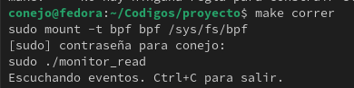

# ModuloIODisk: A module to obtain the bytes written and read to disk

Proof of concept to obtain the bytes written and read to disk for a specific process

## Installation

This module uses `make` as the building system. To install the dependencies. Please, check the following instructions according to your needs:

```bash
# Ubuntu
sudo apt update
sudo apt install -y \
  clang llvm \
  gcc g++ make \
  libbpf-dev libelf-dev \
  linux-headers-$(uname -r)
```

```bash
# Fedora
sudo yum install -y \
  clang llvm \
  gcc gcc-c++ make \
  elfutils-libelf-devel \
  libbpf libbpf-devel \
  kernel-devel-$(uname -r)
```


### Compiling ModuloIODisk

Compiling ModuloIODisk follows the same process as any make project. This compilation create all the nesesary files tu run.

```bash
make
```


## Running ModuloIODisk

When running this module it is waiting to read the actions of the program crearArchivo when running it looks like this:

```bash
make correr
```



## Running test

Currently, there is a file called `"crearArchivo"` It is compiled as follows. By default, it creates a 10MB file to test the module's functionality. This file is executed after the module is run so that it can be intercepted.

Once the test is finished, exit the execution with `Ctrl+C` to close the module and thus generate the file `eventos_log.csv` in the root folder of the module.


#### Compilation
```bash
g++ -o crearArchivo crearArchivo.cpp
```
#### Execution
```bash
./crearArchivo
```
## Future work

- prompt to checkout different proceses
- test with difernet file sizes
- generate the file during execution


### Author

* Gabriel Conejo Valerio

### Official Repository

* Github: https://github.com/raxzers/ModuloIODisk
